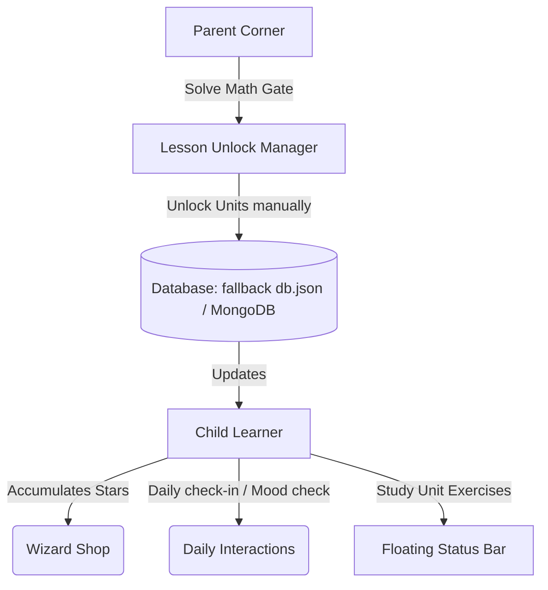

# Reusable Gamification & Curriculum Integration Framework (Skill Guide)

This guide documents the architecture, database schema, API contracts, and reusable components of the Mascot Gamification & Learning Progress tracking system. Use this "Skill" file to easily adapt this framework for new curriculums (such as Mathematics, Science, or Advanced Language courses).

---

## 1. System Architecture

The framework consists of a backend user profile system and a frontend dashboard/exercise layout. It tracks three core elements:
1. **Curriculum Mapping**: Unlocking structure of units/missions.
2. **Kid Gamification**: Star-accumulating items shop, check-in streak, and emotional mascot interactives.
3. **Parent Controls**: Progress monitoring, mood journal viewing, and manual lesson unlocking.



---

## 2. Database Schema Configuration

To support any subject curriculum, expand the astronaut model with manual unlock fields and multi-accessory slots. Refer to [Astronaut.ts](file:///c:/Users/Admin/English/backend/src/models/Astronaut.ts) for reference.

### 2.1 Model Fields
Add the following optional schema properties to manage subject progress and customization:

| Field Name | Type | Description |
| :--- | :--- | :--- |
| `stars` | Number | Overall accumulated stars (currency). |
| `completed{Subject}` | Array of Numbers | List of successfully finished unit IDs for `{Subject}`. |
| `manuallyUnlocked{Subject}` | Array of Numbers | List of parent-override unlocked unit IDs for `{Subject}`. |
| `equippedAccessories` | Array of Strings | Equipped accessory item IDs (multi-slot). |
| `checkInStreak` | Number | Count of continuous check-in days. |
| `checkInHistory` | Array of Strings | Logged local dates (`YYYY-MM-DD`). |
| `dailyInteractions` | Array of Objects | Mood records: `{ date: string, mood: string, message: string }`. |

### 2.2 Database Helper Adapter
Implement a fallback mechanism (like [dbHelper.ts](file:///c:/Users/Admin/English/backend/src/utils/dbHelper.ts)) that supports both MongoDB (production) and file-based JSON database (local dev). Ensure array fields merge properly on saving:

```typescript
// Merge array fields on saving to prevent overwrite anomalies
const updated = {
  ...existing,
  ...astronautData,
  completedPlanets: astronautData.completedPlanets || existing.completedPlanets || [],
  manuallyUnlockedPlanets: astronautData.manuallyUnlockedPlanets || existing.manuallyUnlockedPlanets || [],
  equippedAccessories: astronautData.equippedAccessories || existing.equippedAccessories || [],
  checkInHistory: astronautData.checkInHistory || existing.checkInHistory || [],
};
```

---

## 3. Backend API Route Contracts

Implement the following endpoints on your server. Refer to [astronautController.ts](file:///c:/Users/Admin/English/backend/src/controllers/astronautController.ts) for details.

### 3.1 Fetch Profile (`POST /api/astronaut/profile`)
- **Body**: `{ name: string, password?: string }`
- **Response**: Sanitized `Astronaut` JSON profile object. If a profile doesn't exist, create it. If a PIN is required, return `{ status: 'need_password' }`.

### 3.2 Daily Check-In (`POST /api/astronaut/checkin`)
- **Body**: `{ name: string }`
- **Response**: `{ success: true, earnedStars: number, streak: number, astronaut: Astronaut }`
- **Logic**: Increases `stars` and `checkInStreak`. Prevents duplicate check-ins on the same day.

### 3.3 Parent Unlock (`POST /api/astronaut/unlock-units`)
- **Body**: `{ name: string, unitIds: number[], system: 'mover' | 'pet' | 'prestarter' }`
- **Response**: `{ success: true, astronaut: Astronaut }`
- **Logic**: Updates `manuallyUnlocked{Subject}` array in the database.

### 3.4 Multi-Accessory Equipping (`POST /api/astronaut/equip-accessory`)
- **Body**: `{ name: string, accessoryId: string }`
- **Response**: `{ success: true, astronaut: Astronaut }`
- **Logic**: Resolves accessories by slot Category (`head` \| `body` \| `hand` \| `shield`). If a matching slot is already equipped, replace it. Otherwise, add to `equippedAccessories`.

---

## 4. Frontend Reusable Components

Create these UI components in Vanilla CSS/JS.

### 4.1 Layered Mascot Visualizer (`MascotVisual.tsx`)
Render the base avatar and absolute-overlay emojis. Allows equipping one item per slot category.
Path: [MascotVisual.tsx](file:///c:/Users/Admin/English/frontend/src/components/MascotVisual.tsx)

```tsx
export default function MascotVisual({ avatar, equippedAccessories = [], size = 'text-5xl' }) {
  // 1. Define variables for slots
  let headEmoji = '', bodyEmoji = '', handEmoji = '', shieldEmoji = '';
  // 2. Loop through equippedAccessories and map accessoryId to emoji & positioning classes
  // 3. Render base avatar with z-10 index, and overlays with appropriate absolute positioning
  return (
    <div className="relative inline-flex items-center justify-center shrink-0">
      <span className={`${size} relative z-10`}>{avatar}</span>
      {headEmoji && <span className="absolute -top-5 z-20 animate-bounce">{headEmoji}</span>}
      {bodyEmoji && <span className="absolute -bottom-1 z-10">{bodyEmoji}</span>}
      {handEmoji && <span className="absolute -bottom-2 -right-3 z-20">{handEmoji}</span>}
      {shieldEmoji && <span className="absolute -top-1 -left-4 z-0 animate-pulse">{shieldEmoji}</span>}
    </div>
  );
}
```

### 4.2 Parent Security Guard (Math Gate)
To block access to Parent Controls, verify with a math challenge in [AccountDashboard.tsx](file:///c:/Users/Admin/English/frontend/src/components/AccountDashboard.tsx):
```tsx
const [mathChallenge, setMathChallenge] = useState(() => {
  const num1 = Math.floor(Math.random() * 8) + 2;
  const num2 = Math.floor(Math.random() * 8) + 2;
  return { num1, num2, answer: num1 * num2 };
});
const [parentCodeInput, setParentCodeInput] = useState('');
const [parentVerified, setParentVerified] = useState(false);

// Challenge check
if (!parentVerified) {
  return (
    <div>
      <p>Ba mẹ giải phép toán để vào góc quản lý nhé: {mathChallenge.num1} x {mathChallenge.num2} = ?</p>
      <input value={parentCodeInput} onChange={e => setParentCodeInput(e.target.value)} />
      <button onClick={() => { if (parseInt(parentCodeInput) === mathChallenge.answer) setParentVerified(true); }}>Xác minh</button>
    </div>
  );
}
```

### 4.3 Persistent Floating Status Bar
Inject a floating card into the practice screens to display study health metrics and trigger the check-in modal.
Refer to [App.tsx](file:///c:/Users/Admin/English/frontend/src/App.tsx#L427-L460) or [PETApp.tsx](file:///c:/Users/Admin/English/frontend/src/components/pet/PETApp.tsx#L158-L195):

```tsx
<div className="fixed top-4 right-4 z-50 flex items-center gap-3 bg-white/95 backdrop-blur border-2 border-purple-200 rounded-2xl px-4 py-2.5 shadow-xl transition-all">
  <MascotVisual avatar={astronaut.avatar} equippedAccessories={astronaut.equippedAccessories} size="text-2xl" />
  <div className="flex flex-col">
    <span className="text-[10px] font-black text-purple-600 uppercase">{astronaut.name}</span>
    <div className="flex items-center gap-2 text-xs font-black">
      <span className="text-amber-500">⭐ {astronaut.stars}</span>
      <span className="text-rose-500">🔥 {astronaut.checkInStreak || 0}d</span>
    </div>
  </div>
  <button onClick={() => setIsCheckInOpen(true)} className="p-1.5 bg-purple-50 rounded-lg">📅</button>
</div>
```

### 4.4 Astronaut State Sanitizer
Avoid blank screen rendering due to undefined properties (e.g. on new profile sign-ups or schema changes). Ensure data is sanitized before loading into state:
```typescript
const sanitizeAstronaut = (data: any): Astronaut => ({
  name: data.name || '',
  stars: typeof data.stars === 'number' ? data.stars : 0,
  completedPlanets: Array.isArray(data.completedPlanets) ? data.completedPlanets : [],
  completedPreStarter: Array.isArray(data.completedPreStarter) ? data.completedPreStarter : [],
  completedPET: Array.isArray(data.completedPET) ? data.completedPET : [],
  manuallyUnlockedPlanets: Array.isArray(data.manuallyUnlockedPlanets) ? data.manuallyUnlockedPlanets : [],
  equippedAccessories: Array.isArray(data.equippedAccessories) ? data.equippedAccessories : (data.equippedAccessory ? [data.equippedAccessory] : []),
  checkInStreak: typeof data.checkInStreak === 'number' ? data.checkInStreak : 0,
  dailyInteractions: Array.isArray(data.dailyInteractions) ? data.dailyInteractions : []
});
```

---

## 5. Adaptation Guide: Creating a "Mathematics" System (Example)

Follow these steps to replicate the framework for a new curriculum, e.g., "MathApp":

1. **Schema Extension**: Add `completedMath` and `manuallyUnlockedMath` fields (Number Arrays) to the database schema.
2. **Curriculum Definition**: Define your course syllabus data (`math-units.json`) containing chapter listings.
3. **Sidebar Navigation**:
   * Add a `MathSidebar.tsx` component that evaluates unlocking based on:
     ```typescript
     const isUnlocked = manuallyUnlockedMath.includes(unitId) || completedMath.includes(prevUnitId);
     ```
4. **Parent Control Integration**:
   * Expand the Parent Corner Unlock panel checklist with a segment for Math units (e.g., Numbers, Operations, Fractions).
   * Hook checks to fire `/api/astronaut/unlock-units` with `{ system: 'math' }`.
5. **Practice Screen overlay**:
   * Render the game/test component (`MathPractice.tsx`).
   * Wrap it with the `MascotVisual` Floating Status Bar to show stars currency and the daily calendar.
